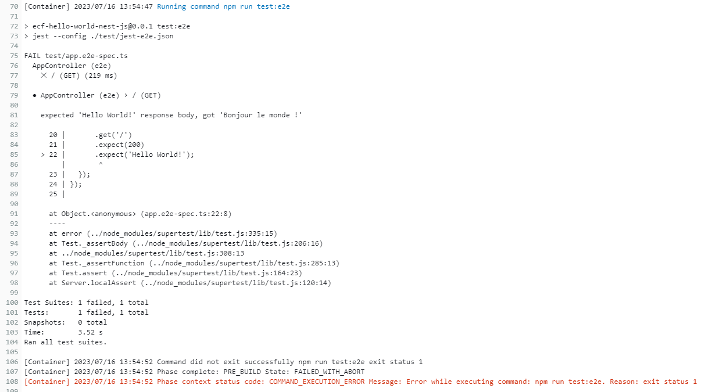
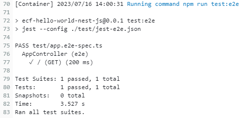

# ECF Hello World (NestJS)
📅 [**Planning Notion**](https://mirror-paw-f24.notion.site/f2fa7cecae5a4cd4a1792bf963ec744a?v=b71bd3754f5541c1a7c1a23cbb2f1ca9) 📅  
___ 
## Table of content
- [ECF Hello World (NestJS)](#ecf-hello-world-nestjs)
  - [Table of content](#table-of-content)
  - [Activité Type 2 : Déploiement d’une application en continu](#activité-type-2--déploiement-dune-application-en-continu)
    - [1. Créez une application Nodejs (hello word) à partir d’une image docker Nodejs que vous exposerez sur un port (de votre choix) (1 point).](#1-créez-une-application-nodejs-hello-word-à-partir-dune-image-docker-nodejs-que-vous-exposerez-sur-un-port-de-votre-choix-1-point)
      - [1.1 Installation de nodeJS, npm et nestJS](#11-installation-de-nodejs-npm-et-nestjs)
      - [1.2 Initialisation d'un projet nestJS](#12-initialisation-dun-projet-nestjs)
      - [1.3 Test de l'application](#13-test-de-lapplication)
    - [2. Dockerizez votre application Nodejs (2 points).](#2-dockerizez-votre-application-nodejs-2-points)
      - [2.1 Dockerfile](#21-dockerfile)
      - [2.2 Build de l'image](#22-build-de-limage)
      - [2.3 Lancement du container](#23-lancement-du-container)
      - [2.4 Test de l'application dockerisée](#24-test-de-lapplication-dockerisée)
    - [3. Écrivez le script qui build/test et le nodejs et déployez le sur le kube créé](#3-écrivez-le-script-qui-buildtest-et-le-nodejs-et-déployez-le-sur-le-kube-créé)
      - [3.1 Utilisation de AWS Codepipeline](#31-utilisation-de-aws-codepipeline)
      - [3.2 Utilisation de AWS CodeBuild](#32-utilisation-de-aws-codebuild)
    - [Sources utilisées](#sources-utilisées)
 
## Activité Type 2 : Déploiement d’une application en continu

### 1. Créez une application Nodejs (hello word) à partir d’une image docker Nodejs que vous exposerez sur un port (de votre choix) (1 point).

Choix du Framework : NestJS  

#### 1.1 Installation de nodeJS, npm et nestJS 

- On peut installer nodeJS en utilisant le gestionnaire de paquets apt.  
Il faut commencer par mettre à jour l'index du dépot, puis installer le paquet nodejs
  ``` 
  sudo apt update
  sudo apt install nodejs
  ```  
- Tester la version installée de nodeJS.  
  Remarque : la version 16, ou supérieure est nécessaire pour nesJS
  ``` 
  node -v
  ```  
    
- Installer le gestionnaire de paquets de nodejs : npm
  ```
  sudo apt install npm
  ```
- Installer nestjs à l'aide de npm 
  ```
  npm install -g @nestjs/cli
  ```
#### 1.2 Initialisation d'un projet nestJS

- Initialisation d'un nouveau projet. Remplacer `project-name` par ne nom du projet  
  ```
  nest new project-name
  ```
  
- Une fois le projet initialisé, on peut lancer l'application  
  ```
  npm run start
  ```
  

#### 1.3 Test de l'application

Le port d'écoute par défaut est le port 3000 (information visible dans **dist/main.js** : ` await app.listen(3000)`)

On ouvre un navigateur sur l'adresse `localhost:3000` et on constate que l'application fonctionne :  
  

### 2. Dockerizez votre application Nodejs (2 points).

#### 2.1 Dockerfile

Création d'un [Dockerfile](Dockerfile)  
Remarque : on expose le port 3000  

#### 2.2 Build de l'image

- Build de l'image avec la commande suivante
  ```
  docker build -t ecf-hello-world-nestjs .
  ```
    
- On vérifie que l'image est bien présente :  
  

#### 2.3 Lancement du container

- Lancement d'un container à partir de l'image créée :  
  ```
  docker run -d -p 3001:3000 ecf-hello-world-nestjs:latest
  ```
  
  Remarque : on map le port 3000 du container à un port différent (ici 3001) de notre environnement local pour s'assurer que l'on récupère bien l'application "dockerisée" dans notre navigateur.

#### 2.4 Test de l'application dockerisée

- On ouvre un navigateur sur l'adresse `localhost:3001` et on constate que l'application fonctionne :  
  

### 3. Écrivez le script qui build/test et le nodejs et déployez le sur le kube créé

#### 3.1 Utilisation de AWS Codepipeline

#### 3.2 Utilisation de AWS CodeBuild

- Création du fichier [buildspec.yml](buildspec.yml) à la racine du dépôt.  
  - Un test e2e est réalisé dans la phase pre_build, en précisant le paramètre `on-failure: ABORT`.  
  Ainsi, si le test e2e échoue, le build s'arrête immédiatement.  
    - Logs quand le tests e2e échoue :  
  
    - Logs quand le tests e2e réussi :  
  
- affectation de la policiy *`AmazonEC2ContainerRegistryReadOnly`* au rôle IAM utilisé pour le projet build, afin qu'il puisse se connecter à AWS ECR (source [stackoverflow](https://stackoverflow.com/questions/43033559/aws-codebuild-getauthorizationtoken-failed))  
- pour le projet code Build, il faut sélectionner l'option `Privileged` dans `CodeBuild > Build projects > ECF-Hello-world-nestJS > Edit Environment > Override image`, sinon on obtient une erreur du type `Cannot connect to the Docker daemon` au moment d'exécuter la commande `docker build` (source [github.com/aws/aws-codebuild-docker-images](https://github.com/aws/aws-codebuild-docker-images/issues/164))

### Sources utilisées  

[Doc NestJS](https://docs.nestjs.com/first-steps#running-the-application)  
[tomray.dev - How to write a NestJS Dockerfile optimized for production](https://www.tomray.dev/nestjs-docker-production)  
[AWS CodeBuild - Guide de l'utilisateur](https://docs.aws.amazon.com/fr_fr/codebuild/latest/userguide/welcome.html)  
[AWS - Exemple Amazon ECR pour CodeBuild](https://docs.aws.amazon.com/fr_fr/codebuild/latest/userguide/sample-ecr.html)  
[modus create - Deploy a NestJS Application to Amazon ECS Using CodePipeline](https://moduscreate.com/blog/deploy-a-nestjs-application-to-amazon-ecs-using-codepipeline/)