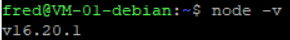
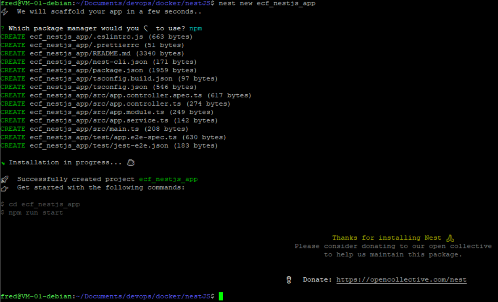
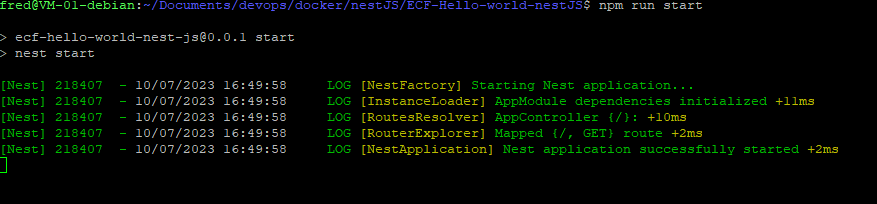
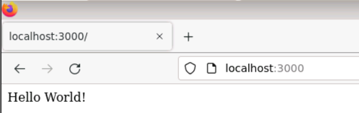
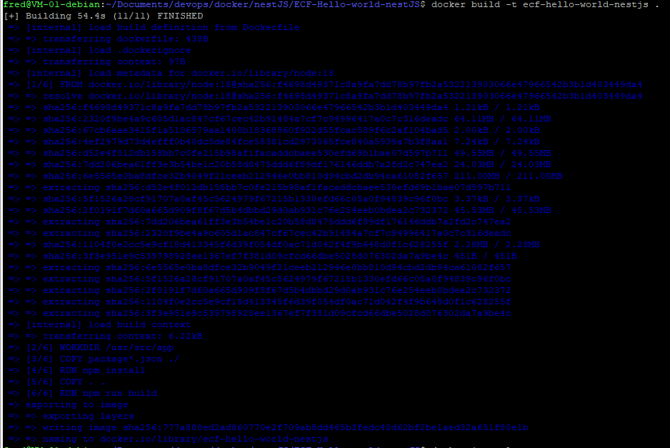
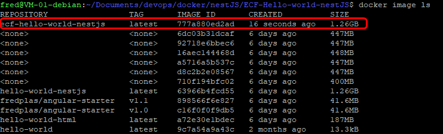
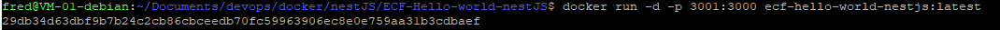
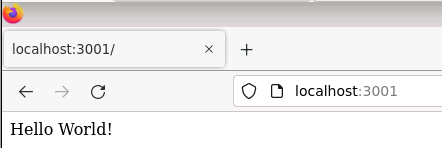

# Table of content
- [Activité Type 2 : Déploiement d’une application en continu](#activité-type-2--déploiement-dune-application-en-continu)
  - [1. Créez une application Nodejs (hello word) à partir d’une image docker Nodejs que vous exposerez sur un port (de votre choix) (1 point).](#1-créez-une-application-nodejs-hello-word-à-partir-dune-image-docker-nodejs-que-vous-exposerez-sur-un-port-de-votre-choix-1-point)
    - [1.1 Installation de nodeJS, npm et nestJS](#11-installation-de-nodejs-npm-et-nestjs)
    - [1.2 Initialisation d'un projet nestJS](#12-initialisation-dun-projet-nestjs)
    - [1.3 Test de l'application](#13-test-de-lapplication)
  - [2. Dockerizez votre application Nodejs (2 points).](#2-dockerizez-votre-application-nodejs-2-points)
    - [2.1 Dockerfile](#21-dockerfile)
    - [2.2 Build de l'image](#22-build-de-limage)
    - [2.3 Lancement du container](#23-lancement-du-container)
    - [2.4 Test de l'application dockerisée](#24-test-de-lapplication-dockerisée)
  - [Sources utilisées](#sources-utilisées)


# Activité Type 2 : Déploiement d’une application en continu

## 1. Créez une application Nodejs (hello word) à partir d’une image docker Nodejs que vous exposerez sur un port (de votre choix) (1 point).

Choix du Framework : NestJS  

### 1.1 Installation de nodeJS, npm et nestJS 

- On peut installer nodeJS en utilisant le gestionnaire de paquets apt.  
Il faut commencer par mettre à jour l'index du dépot, puis installer le paquet nodejs
  ``` 
  sudo apt update
  sudo apt install nodejs
  ```  
- Tester la version installée de nodeJS.  
  Remarque : la version 16, ou supérieure est nécessaire pour nesJS
  ``` 
  node -v
  ```  
    
- Installer le gestionnaire de paquets de nodejs : npm
  ```
  sudo apt install npm
  ```
- Installer nestjs à l'aide de npm 
  ```
  npm install -g @nestjs/cli
  ```
### 1.2 Initialisation d'un projet nestJS

- Initialisation d'un nouveau projet. Remplacer `project-name` par ne nom du projet  
  ```
  nest new project-name
  ```
  
- Une fois le projet initialisé, on peut lancer l'application  
  ```
  npm run start
  ```
  

### 1.3 Test de l'application

Le port d'écoute par défaut est le port 3000 (information visible dans **dist/main.js** : ` await app.listen(3000)`)

On ouvre un navigateur sur l'adresse `localhost:3000` et on constate que l'application fonctionne :  
  

## 2. Dockerizez votre application Nodejs (2 points).

### 2.1 Dockerfile
Création d'un [Dockerfile](Dockerfile)  
Remarque : on expose le port 3000  

### 2.2 Build de l'image
- Build de l'image avec la commande suivante
  ```
  docker build -t ecf-hello-world-nestjs .
  ```
    
- On vérifie que l'image est bien présente :  
  

### 2.3 Lancement du container
- Lancement d'un container à partir de l'image créée :  
  ```
  docker run -d -p 3001:3000 ecf-hello-world-nestjs:latest
  ```
  
  Remarque : je map le port 3000 du container au port 3001 de mon environnement local pour m'assurer que je récupère bien l'application "dockerisée" dans mon navigateur.

### 2.4 Test de l'application dockerisée
- On ouvre un navigateur sur l'adresse `localhost:3001` et on constate que l'application fonctionne :  
  

## Sources utilisées
[Doc NestJS](https://docs.nestjs.com/first-steps#running-the-application)  
[www.tomray.dev](https://www.tomray.dev/nestjs-docker-production)  